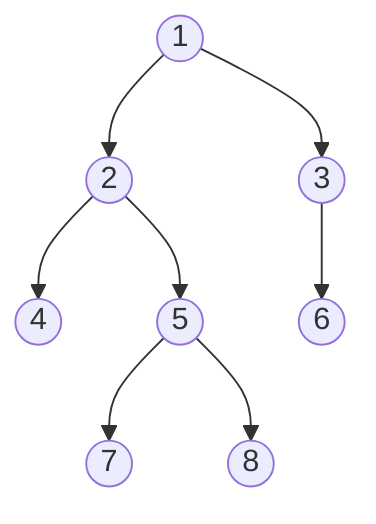
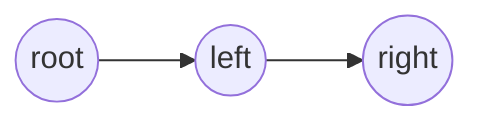
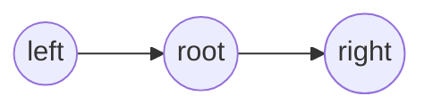
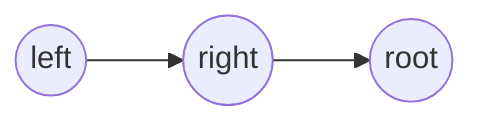

# 树
## 二叉树
### 二叉树的遍历
二叉树是一种重要的数据结构，很多其他数据结构都是基于二叉树的基础演变而来的。对于二叉树，有深度遍历和广度遍历。

由于树的定义本身就是递归定义，因此采用递归的方法去实现树的三种遍历不仅容易理解而且代码简洁。

深度遍历：
- 前序遍历
- 中序遍历
- 后续遍历

广度遍历：
- 只需按层次遍历即可

例：<br>
对于这样一个二叉树：



下面逐个介绍其遍历方式

#### 前序遍历



即先遍历根节点，再遍历左树，右树


代码：
```cpp
void dfs(int u)
{
    int l = v[u].left, r = v[u].right;
    cout << u << ' ';
    if (l) dfs(l);
    if (r) dfs(r);
}
```

结果：`1 2 4 5 7 8 3 6`

#### 中序遍历



即先遍历左树，再遍历根节点，右树

代码：
```cpp
void dfs(int u)
{
    int l = v[u].left, r = v[u].right;
    if (l) dfs(l);
    cout << u << ' ';
    if (r) dfs(r);
}
```

结果；`4 2 7 5 8 1 6 3`

#### 后序遍历



即先遍历左树，再遍历右树，根节点

代码：
```cpp
void dfs(int u)
{
    int l = v[u].left, r = v[u].right;
    
    if (l) dfs(l);
    if (r) dfs(r);
    cout << u << ' ';
}
```

结果：`4 7 8 5 2 6 3 1`

#### 层次遍历
从上到下一层层遍历

代码：
```cpp
void bfs(int u)
{
    queue<int> q;
    
    q.push(u);
    
    while (q.size())
    {
        int t = q.front();
        q.pop();
        
        int l = v[t].left, r = v[t].right;
        
        cout << t << ' ';
        
        if (l) q.push(l);
        if (r) q.push(r);
    }
}
```

结果：`1 2 3 4 5 6 7 8`

## 多叉树
## 森林


